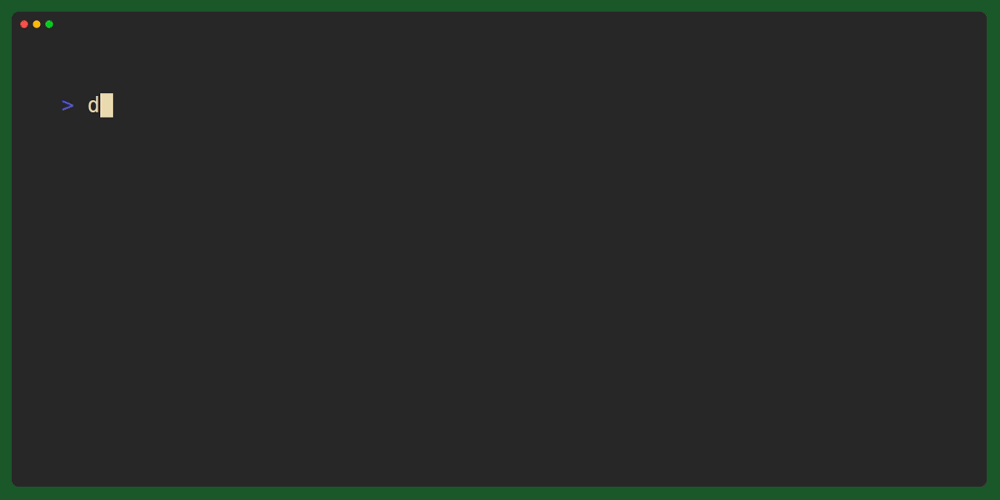

# DNSChat

A DNS server that connects to an OpenAI LLM.
Can send requests to the LLM using dns queries.
Set the contents of the message to the LLM as the QNAME, and request a TXT record.

The response from the LLM is returned as this TXT record. If the LLM response is longer than 255 bytes then the response is broken up and returned as multiple records. Though since this uses UDP i _think_ the upper limit is 512 bytes for the whole message.

- Requests are cached for an hour based on the query, so if you send the exact same query you get the exact same reply.
- Part of the prompt to the LLM instructs it to have short replies, and use basic characters and formating.

I also added tracking for in-flight requests. DNS queries have a short timeout by default, not always long enough for an LLM to generate the response. In a more naive implementation, the DNS query would be retried by the client and trigger another LLM request, which would also take too long to reply, and so on until the client gives up.
With in-flight request tracking, if a duplicate query comes in while the response is still generating (e.g the intial query that triggered the generation timed-out) then we wait until the original request is finished, or until this query times out too. In practice, if the first DNS query times-out, the LLM response is usually ready by the time the 2nd attempt is sent by the client.

## Usage

### Environment Variables
- `OPENAI_API_KEY`: Your OpenAI API key (required)


```
go run main.go -p 8081
```
**Flags**
- `-p <port>`: Port to listen on (default: 53)
```
dig @127.0.0.1 -p 8081 "<Your query here>" TXT +short
 +time=10
```


I like to use `+short` to make the output nicer, and `+time=10` to give the LLM a bit longer to generate the response.


Made using [VHS](https://github.com/charmbracelet/vhs)
See [demo.tape](demo.tape)
